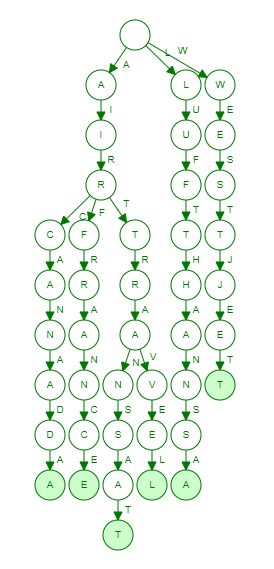

# Flight Checker System

## Project Description
##### The purpose of this application is efficiently store and showcase flight data. Users are able to search by desired airline or airport name and results are shown.
##### The project is split into two parts: Data Ingestion and User Application. Data ingestion is implemented in Python where airplane flight data is ingested from a free API called Aviationstack. The user application is fully built in C++ and currently allows users to interract with in terminal. Future iterations of this project will include a better UI made with Qt.

## Data Ingestion
##### There are two python files that handle data ingestion from the Aviationstack API.
##### api_request.py: This script directly calls the API and outputs the results into a json file called ingest.json .
##### json_merge.py: This script aims to properly merge ingest.json with a container that stores all accumulated data called all_data.json, this includes omitting duplicate entries.

#### Merging Process
##### The way duplicate entries are handled is by creating a custom key structure for each data entry based on attributes of the data. The key consists of the concatenation of departure IATA, arrival IATA and the flight number. This aims to ensure that the flight paths included in the dataset are unique. Saved keys are stored in a file called keys.csv
##### First, I create the key for each ingested data entries. If these keys already exist in keys.csv, the data entry associated with that key is omitted from the merge.

## User Application

#### Loading Data into Application
##### When the user application starts running, data from all_data.json needs to be loaded into the program. I chose to load the data in what I believe is the best STL container for this application, std::unordered_multimap. It takes O(n) time to populate the map, however it ensures an O(1) constant lookup time for later stages which is worth the trade off. Simulatenously, airport and airline names are inserted into a Trie.
##### This entire loading process takes ~0.7 seconds (when all_data.json has ~9000 records) when running on an i7-8750H CPU and when the loading code is multithreaded.

#### Trie Implementation
##### To implement an autocomplete feature, I had to fully implement a Trie data structure from scratch. This includes a Trie class and a TrieNode class. The Trie structurei is essential for this application because it stores all strings (airline and airport names) in a format that is efficient to insert and traverse(lookup).

##### Example visualization of a Trie

#### Search Functionality
##### Note: This section is subject to change once a proper UI is created.
##### The user is prompted to enter an airport or airline name to search and a numbered list of results are shown. This string is passed into the Trie autocomplete() method which will populate which airline/airport names matched with the partial search. Then the user is prompted to enter the number associated with the result list. All entries for that search result are displayed.

